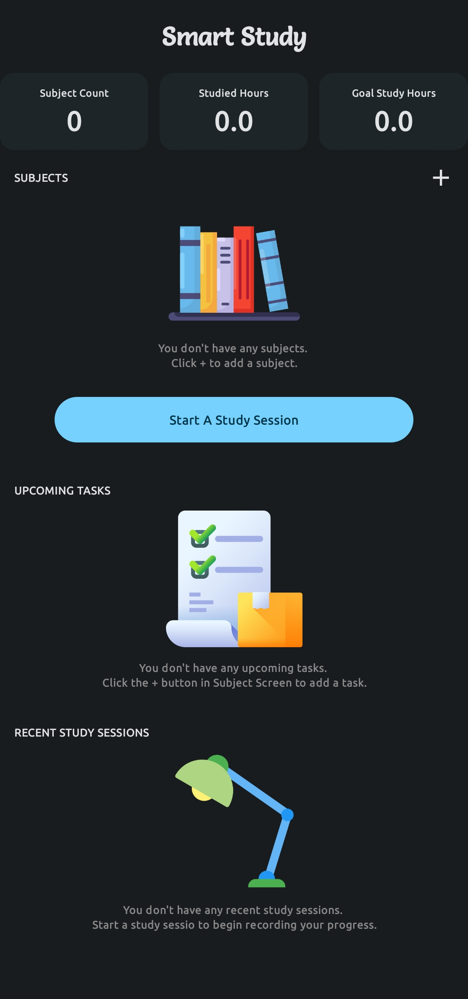
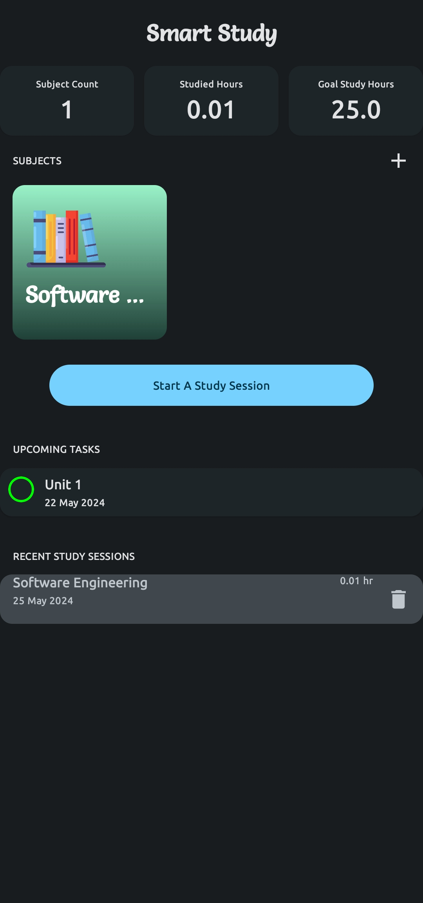
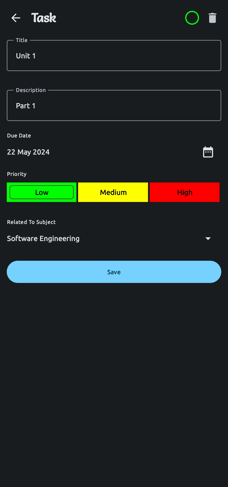
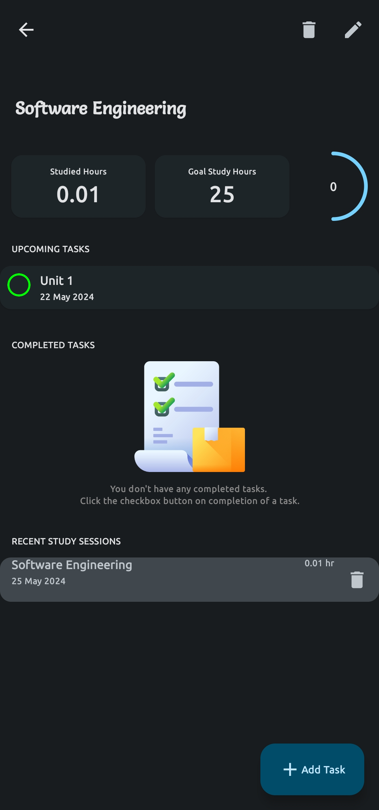
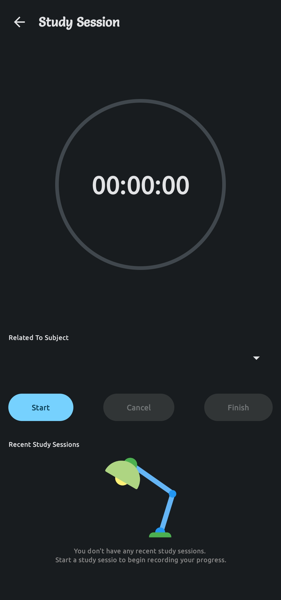

# Smart Study App

Welcome to the Smart Study App! This app is designed to help you manage your study schedule effectively by organizing subjects, tasks, and study sessions. Built with Jetpack Compose, Room Library, and MVVM architecture, the Smart Study App ensures a modern, efficient, and scalable experience.

## Features

- **Dashboard Screen**: Get an overview of your study progress and upcoming tasks.
- **Add Subject**: Create and manage different subjects.
- **Add Task**: Assign tasks to your subjects to keep track of your study goals.
- **Create Session**: Schedule study sessions for each subject to maintain a consistent study routine.

## Prerequisites

- Android Studio Bumblebee or later
- Gradle 7.0+
- Minimum SDK version 21
- Kotlin 1.6.0+

## Getting Started

To get a local copy up and running, follow these steps:

### Clone the Repository

```bash
git clone https://github.com/yourusername/smart-study-app.git
cd smart-study-app
```

### Open the Project

1. Open Android Studio.
2. Select `Open an existing Android Studio project`.
3. Navigate to the `smart-study-app` directory and click `OK`.

### Build and Run the App

1. Ensure your Android device or emulator is connected.
2. Click on the `Run` button in Android Studio or use the shortcut `Shift + F10`.
3. The app will build and install on your device/emulator.

## Project Structure

The app follows the MVVM (Model-View-ViewModel) architecture pattern, providing a clear separation of concerns and making the codebase more maintainable.

### Main Components

- **Model**: Represents the data layer, managed with Room Library for local database operations.
- **View**: UI layer built with Jetpack Compose, rendering the UI components.
- **ViewModel**: Handles the business logic, fetching data from the Model and preparing it for the View.

### Directory Layout

```
smart-study-app/
├── app/
│   ├── src/
│   │   ├── main/
│   │   │   ├── java/com/example/smartstudy/
│   │   │   │   ├── data/
│   │   │   │   │   ├── dao/
│   │   │   │   │   ├── entities/
│   │   │   │   │   ├── repositories/
│   │   │   │   ├── ui/
│   │   │   │   │   ├── screens/
│   │   │   │   │   ├── components/
│   │   │   │   │   ├── viewmodel/
│   │   │   │   ├── di/
│   │   │   │   ├── MainActivity.kt
│   │   │   ├── res/
│   │   │   ├── AndroidManifest.xml
│   ├── build.gradle
├── build.gradle
└── settings.gradle
```

## Usage

### Dashboard Screen

The Dashboard screen provides an overview of your subjects, tasks, and sessions. It helps you keep track of your study progress and upcoming deadlines.

### Add a Subject

1. Navigate to the "Add Subject" screen from the Dashboard.
2. Enter the subject name and any additional details.
3. Click "Save" to add the subject to your list.

### Add a Task

1. Select a subject from your list.
2. Navigate to the "Add Task" screen.
3. Enter the task details, such as title, description, and due date.
4. Click "Save" to associate the task with the selected subject.

### Create a Session

1. Select a subject from your list.
2. Navigate to the "Create Session" screen.
3. Enter the session details, such as date, start time, and duration.
4. Click "Save" to schedule the session for the selected subject.

### Images

<div style="display: flex; flex-wrap: wrap; justify-content: space-between;">
  <div style="flex: 0 0 30%;" >
    
  </div>
  <div style="flex: 0 0 30%;">
    
  </div>
  <div style="flex: 0 0 30%;">
    
  </div>
  <div style="flex: 0 0 45%;">
    
  </div>
  <div style="flex: 0 0 45%;">
    
  </div>
</div>


## Contributing

Contributions are welcome! Please follow these steps to contribute:

1. Fork the repository.
2. Create a new branch (`git checkout -b feature/your-feature-name`).
3. Commit your changes (`git commit -m 'Add some feature'`).
4. Push to the branch (`git push origin feature/your-feature-name`).
5. Open a Pull Request.

## Acknowledgements

- [Jetpack Compose](https://developer.android.com/jetpack/compose)
- [Room Library](https://developer.android.com/jetpack/androidx/releases/room)
- [MVVM Architecture](https://developer.android.com/jetpack/guide)
- [Dagger Hilt]

